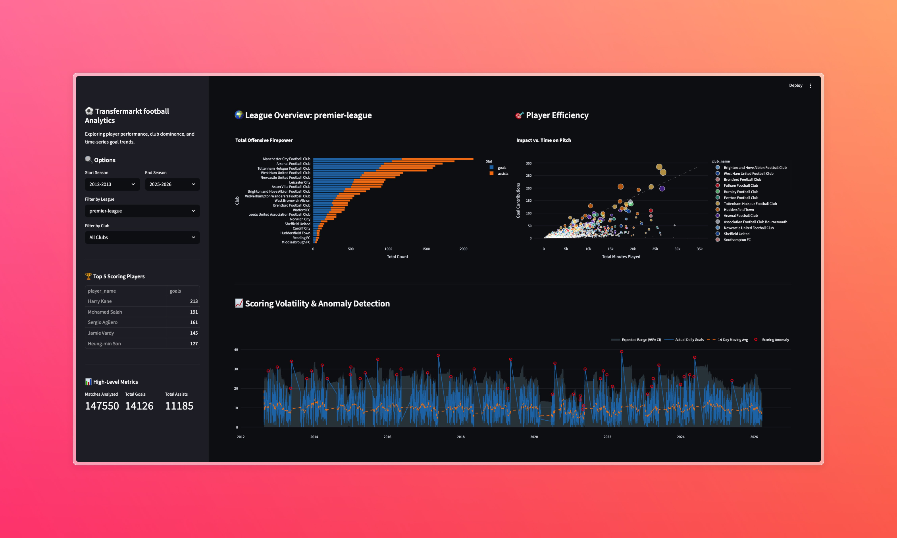

# ⚽ Transfermarkt Data Pipeline & Analytics

## 🎯 Problem Description

Football analytics relies heavily on massive, continuously updating datasets encompassing player match statistics, club performance, and transfer histories. While platforms like Transfermarkt hold a wealth of this information (spanning from 2012 to the present), the raw data is deeply fragmented, relational, and not structured for immediate analytical consumption.

**The Core Problem:**
For football analysts, data scientists, or enthusiasts to extract meaningful insights—such as evaluating a player's goal contribution efficiency, comparing league-wide offensive firepower, or identifying statistical scoring anomalies—they traditionally have to rely on manual data extraction, disjointed spreadsheets, and ad-hoc cleaning scripts. This manual approach is:
1. **Tedious and Error-Prone:** Cleaning over a decade of match and player data requires complex joins and datatype management.
2. **Unscalable:** As new match data is generated weekly, updating local CSVs or disconnected databases becomes a massive bottleneck.
3. **Inaccessible:** Without a centralized data warehouse, running time-series analytics (like 14-day rolling averages for scoring volatility) is incredibly slow and computationally heavy.

**The Solution:**
This project solves the data integration bottleneck by building a fully automated, end-to-end data engineering pipeline. Instead of manual processing, the architecture systematically orchestrates the extraction of Transfermarkt data, handles heavy transformations in the cloud, and serves a highly structured Data Warehouse. This infrastructure eliminates the need for manual data wrangling, providing a reliable single source of truth that instantly powers an interactive dashboard for seamless football analytics.

## 🏗 Architecture & Tech Stack

- **Orchestration:** Apache Airflow (Containerized via Docker)
- **Infrastructure as Code (IaC):** Terraform
- **Cloud Provider:** Google Cloud Platform (GCP)
- **Data Warehouse:** BigQuery (`transfermarkt_dwh`)
- **Data Transformation:** dbt (Data Build Tool)
- **Frontend / Analytics:** Streamlit & Plotly

## 🗄️ Data Warehouse Optimization (BigQuery)

The core analytical data is stored in Google BigQuery (within the `transfermarkt_dwh` dataset). To ensure high performance, minimize latency for the upstream Streamlit dashboard, and reduce querying costs during dbt transformations, the tables are heavily optimized. 

The optimization strategy categorizes tables into **Fact** (large, time-series) and **Dimension** (smaller, descriptive) models:

### 1. Fact Tables (Partitioned & Clustered)
Applies to: `appearances`, `games`, `player_valuations`, `game_events`, `game_lineups`.
* **Partitioning (`date`):** All fact tables are partitioned by the `date` column. 
  * *Why:* The Streamlit dashboard heavily relies on the "Start Season" and "End Season" time-slider. By partitioning by date, BigQuery performs "partition pruning," automatically skipping terabytes of historical match data outside the user's selected time frame. This drastically speeds up both dashboard queries and incremental dbt builds.
* **Clustering (e.g., `player_id`, `competition_id`, `game_id`):** * *Why:* Once the time boundaries are set, the dashboard aggregates data based on specific leagues (competitions) and individual players to calculate "Player Efficiency." Clustering by these foreign keys physically sorts the data blocks in BigQuery, allowing queries filtering for a specific `competition_id` (like the Premier League) or joining events by `game_id` to execute near-instantaneously.

### 2. Dimension Tables (Clustered Only)
Applies to: `players`, `clubs`, `competitions`, `club_games`.
* **No Partitioning:** * *Why:* Dimension tables contain descriptive metadata and are generally much smaller than fact tables. Partitioning these would create overly granular, inefficient blocks that hurt performance rather than help it.
* **Clustering (`club_id`, `competition_id`, `current_club_id`):**
  * *Why:* During the dbt transformation phase, these dimension tables are constantly `JOIN`ed to the massive fact tables to resolve names (e.g., mapping a `club_id` to "Arsenal FC" for the UI). Clustering these tables by their primary/foreign keys guarantees extremely fast join execution when building the final analytical data marts.

## 🔄 Data Transformations (Apache Spark)

To convert the raw, highly normalized Transfermarkt data into an analytics-ready format, this pipeline utilizes **Apache Spark (PySpark)** for robust, scalable data transformations.

Rather than relying on basic SQL views, a dedicated PySpark job handles the complex joining and denormalization processes required to build our final analytical data marts.

**Transformation Workflow:**
1. **Extraction from DWH:** The Spark session connects directly to the BigQuery dataset using the `spark-bigquery-connector` and loads the raw tables (`appearances`, `players`, `clubs`, `competitions`, `games`) into distributed DataFrames.
2. **Denormalization & Joins:** The script performs a series of programmatic left joins to map foreign keys (like `player_id`, `competition_id`, and `game_id`) to their descriptive string values. 
3. **Schema Mapping:** Columns are carefully selected and renamed (e.g., mapping `a.date` to `match_date`, `p.name` to `player_name`) to create a clean, intuitive schema for downstream users.
4. **Loading the Fact Table:** The fully transformed, wide DataFrame is written back into BigQuery as the `fact_player_match_stats` table using the `direct` write method.

**Why PySpark?**
By defining transformations in PySpark rather than simple SQL, the pipeline is highly scalable. Spark's distributed computing framework easily handles the millions of rows of historical match data, ensuring that our downstream Streamlit dashboard queries a pre-aggregated, optimized fact table rather than performing costly joins on the fly.

## ✨ Dashboard Features

The Streamlit application (`app/`) queries the BigQuery fact tables (e.g., `fact_player_match_stats`) dynamically to provide:
- **Total Offensive Firepower:** Stacked bar charts comparing club-level goals and assists.
- **Player Efficiency:** Interactive bubble charts mapping impact (goal contributions) vs. time on the pitch.
- **Scoring Volatility & Anomaly Detection:** Time-series analysis utilizing 14-day rolling averages and 95% confidence intervals to identify statistical scoring anomalies.

## 📂 Repository Structure

```text
📦 Transfermarkt-pipeline
 ┣ 📂 .github/workflows   # CI/CD pipelines
 ┣ 📂 airflow             # DAGs, plugins, and Airflow Docker configuration
 ┣ 📂 app                 # Streamlit dashboard application
 ┣ 📂 secrets             # Local directory for GCP service account keys (git-ignored)
 ┣ 📂 terraform           # HCL scripts to provision GCP GCS buckets and BigQuery datasets
 ┣ 📜 Makefile            # Automation commands for easy setup
 ┗ 📜 README.md
```

## 🚀 How to Run the Project

### 1. Prerequisites
Ensure you have the following installed on your local machine:
* Docker & Docker Compose
* Terraform
* Google Cloud CLI
* Python 3.9+
* `make` utility

```bash
git clone https://github.com/Bank7656/Transfermarkt-pipeline
cd Transfermarkt-pipeline
cp .env.example .env
echo -e "AIRFLOW_UID=$(id -u)" >> .env 
```
Open .env and fill the setup variable
* GCP_PROJECT_ID — your GCP project ID
* GCP_BUCKET_NAME — your GCP Bucket name
* BQ_DATASET - Bigquery dataset name
* KAGGLE_USERNAME / KAGGLE_KEY — from kaggle.com > Account > Create New Token (download kaggle.json, copy the username and key values)

### 2. GCP Setup & Authentication
1. Create a Google Cloud Project.
2. Create a Service Account with the following roles:
   * BigQuery Admin
   * Storage Admin
3. Generate a JSON key for the Service Account.
4. Save the key as `credentials.json` inside the `secrets/` directory.

### 3. Provision Infrastructure (Terraform)
Navigate to the `terraform` directory and initialize the GCP resources (GCS bucket and BigQuery datasets):

```bash
# Create GCP Resource
make infra-up

# Stop and destroy GCP Resource
make stop
```

*Note: You may need to update the `variables.tf` or `terraform.tfvars` file with your specific GCP Project ID.*

### 4. Start the Pipeline (Airflow)
Return to the root directory and use the provided `Makefile` to spin up the Airflow environment:

```bash
# Build and start the Airflow containers
make start

# (Optional) To tear down the environment later:
make stop

# To delete all container
make fclean
```

Once healthy, access the Airflow UI at `http://localhost:8080`. Enable the DAGs to begin fetching and processing the Transfermarkt data.

### 5. Run the Analytics Dashboard
Once the data is successfully loaded into the BigQuery `transfermarkt_dwh` dataset, you can spin up the Streamlit app.



The dashboard will be available at `http://localhost:8501`. By default, it filters to the Premier League / other league to provide an immediate look at top-flight club and player performance.